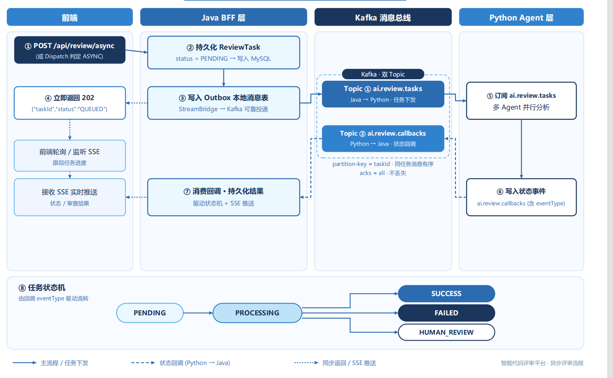

<p align="center">
  <h1 align="center">Sentinel — 智能代码审查与发布风险分析平台</h1>
  <p align="center">
    <strong>当别人在匹配规则的时候，我们在理解代码。</strong>
  </p>
  <p align="center">
    语义理解 · 跨文件影响分析 · 多智能体并行 · 历史事故召回 · 同步拦截 × 异步编排
  </p>
</p>

---

> [!IMPORTANT]
> **30 秒看懂这个项目**：这不是一个"规则扫描器"，而是一个面向**传统规则难以覆盖的未知风险场景**、以 **"规则 + LLM + RAG"** 三元机制构建的智能代码审查 Agent 平台——既能守住规则已知的边界，更能**拓展未知风险的发现能力**。
> 传统工具告诉你"这里违规了"（规则命中）；Sentinel 告诉你"这个改动会带崩哪 5 个接口、为什么、以及我们历史上踩过同样的坑"（语义推理 + 知识召回）——把审查从"查已知"推进到"探未知"。

## 先看数据，再看设计

| 指标 | 数值 | 基线对比 |
|------|------|---------|
| **Top-5 召回率** | **92%** | 单路检索 +34pp |
| **吞吐量** | **143 req/s**（42→83→143） | 单实例基线 3.4× |
| **多 Agent 延迟** | **降低约 40%** | 串行编排 |
| **Agent 输出合规率** | **99%+** | 差异化 prompt + 正则兜底 |
| **长文本超限率** | **~30% → 0** | 类/方法级聚合 + tiktoken 预算 |
| **单次审查成本** | **< ¥0.1** | 典型 diff ~5 文件 / ~300 行 (~16K tokens) |
| **突发 3000 VU 尖峰** | **任务零丢失** | 受理层全量落库 + 全链路对账 |
| **知识库规模** | **80+ 文档 · 5 仓库 · 1.5w+ 向量** | 持续积累 |

> 每个数字都有对应的压测脚本（k6）与代码位置支撑，可逐条自证，见文末「核心指标自证」。

---

## 〇、竞品分析：为什么传统规则匹配型审查平台不够用了

市面上绝大多数代码审查工具（SonarQube、ESLint、SpotBugs、Checkstyle、Fortify、CodeGuru 等）本质上是**规则匹配引擎**：把代码和预先写死的规则模式（正则、AST 模式、控制流模板）比对，命中即报警。这类工具在"规范检查、已知漏洞模板"上依旧高效，但在面对**真实业务代码变更**时，存在四个结构性短板。

### 传统规则型工具的四个短板

| 短板 | 具体表现 | 传统工具的做法 | 后果 |
|------|---------|---------------|------|
| **① 无语义、只会"模式比对"** | 只能识别规则里写死过的模式 | 正则 / AST 模板匹配 | 新出现的漏洞形态、组合型风险永远测不到；规则库要靠人工不断补充 |
| **② 单文件视角、无跨文件理解** | 只看被改动的几行，不理解调用链 | 单文件静态扫描 | 一个公共方法被改，影响到的下游调用方全部漏检；无法输出"这次改动的真实影响半径" |
| **③ 规则库静态、不随事故演进** | 知识来自版本迭代，不来自历史教训 | 依赖社区/厂商慢速更新规则包 | 无法复用团队自己踩过的坑；每次事故后经验难以沉淀 |
| **④ 不可解释、误报多、无法反馈** | 只知道"这条违规"，不知道"为什么该报、报得对不对" | 命中即报、无自我核对 | 误报淹没真问题，工程师养成了"忽略审查结果"的习惯 |

### Sentinel 的答案是"语义理解 + 知识召回 + 多智能体推理"

```
传统工具：   diff ──▶ 规则库(正则/AST模板) ──▶ 命中报警（模式比对）
                          ▲
                          └── 依赖人工不断扩充规则

Sentinel：   diff ──▶ AST实体提取 ──▶ 代码知识图谱 ──▶ 跨文件影响半径
                          │                        │
                          ├─ 多智能体并行推理(安全/性能/规则/RAG) ──▶ 交叉验证评分
                          └─ 历史事故双路召回(向量+关键词) ──▶ LLM 深度分析
                                               │
                          └──▶ 自检验证(降低误报) ──▶ 结构化报告
```

| 维度 | 传统规则匹配型 | Sentinel |
|------|--------------|----------|
| **审查范式** | 规则匹配（命中即报） | 语义推理（理解后再判断） |
| **跨文件理解** | 不能（单文件） | 能（代码知识图谱 + 加权 BFS 影响半径） |
| **知识来源** | 静态规则库（人工维护） | 规则 + 历史事故 RAG 双路召回（随数据演进） |
| **误报控制** | 无自我核对 | 多 Agent 交叉验证 + 用户反馈闭环 |
| **可解释性** | 只能给"违规规则名" | 发现 + 严重度 + 交叉验证溯源 + 影响文件 |
| **审查范围** | 代码规范 / 已知漏洞 | 代码漏洞 |
| **执行方式** | 串行批处理 | 同步极速拦截 + 异步多 Agent 并行 |
| **人机协同** | 一般无 | 高风险自动转人工 Handoff，可追溯 |

---

## 系统定位

面向企业研发全链路，构建 **"同步极速拦截 — 异步高可用编排 — 变更语义理解 — 历史事故知识召回 — 多智能体并行分析 — 结果聚合"** 的完整执行闭环。系统将一次代码审查抽象为可观测、可重试、可回溯的任务实例，通过 Java 稳态编排层与 Python 敏态计算层的异构协作，实现对代码变更的**跨文件语义理解**与**深度逻辑推理**。

审查场景：**代码漏洞风险**——SQL 注入、XSS、硬编码密码、N+1 查询等安全/性能反模式

---

## 架构全景

```
                      Webhook / PR 事件 / 用户提交
                            │
                            ▼
┌──────────────────────────────────────────────────────────────────┐
│                    Java 稳态编排层 (Spring Boot)                   │
│                                                                  │
│   ┌──────────────┐   ┌──────────────────┐   ┌────────────────┐  │
│   │  智能路由网关  │──▶│  同步极速拦截链路  │──▶│  Python 计算节点 │  │
│   │              │   │  Redis 分布式锁   │   │  (HTTP 同步调用) │  │
│   │  负载感知     │   │  Cache Aside 缓存 │   └────────────────┘  │
│   │  特征提取     │   └──────────────────┘                       │
│   │  分类器打分   │                                              │
│   │              │   ┌──────────────────┐   ┌────────────────┐  │
│   │  过载→异步    │──▶│  异步高可用链路    │──▶│ Kafka 双 Topic  │  │
│   └──────────────┘   │  Kafka 持久化     │   │ ① tasks 任务下发   │  │
│                      │  消费者组负载均衡  │       │ ② callbacks 回调 │  │
│                      └──────────────────┘   └───────┬────────┘  │
│                                                     │           │
│                                             ┌───────▼────────┐  │
│                                             │  MQ Consumer   │  │
│   ┌──────────────────────────────────┐      └───────┬────────┘  │
│   │  SSE 实时推送 / 任务状态推送       │◀─────────────────────┘   │
│   └──────────────────────────────────┘                          │
│                                                                  │
│   Outbox 事件表 · 对账兜底 · Tree-Sitter AST · API Key 认证 · 反馈 │
└──────────────────────────────────────────────────────────────────┘
                            │
                            ▼
┌──────────────────────────────────────────────────────────────────┐
│                    Python 敏态计算层 (FastAPI)                     │
│                                                                  │
│   ┌──────────────────────────────────────────────────────────┐   │
│   │              LangGraph 多智能体分析管道                    │   │
│   │                                                          │   │
│   │  diff ──▶ classifier ──▶ impact ──▶ rag(前置检索)        │   │
│   │  (变更解析)  (层级分类)   (影响分析)   (历史事故召回)      │   │
│   │                                   │                      │   │
│   │                                   ▼                      │   │
│   │  AST 解析 + 代码知识图谱   ┌── rules ──────────────┐      │   │
│   │  NetworkX 加权 BFS 影响半径├── security ───────────┤      │   │
│   │  visibility 衰减传播       └── performance ────────┘      │   │
│   │                                   │ 3 Agent 并行          │   │
│   │                                   ▼ (动态裁剪节点)         │   │
│   │  ──▶ scoring ──▶ report                                  │   │
│   │   (交叉验证评分)  (结构化报告)                             │   │
│   │   LLM + 确定性兜底                                        │   │
│   └──────────────────────────────────────────────────────────┘   │
│                                                                  │
│   ┌──────────────────────────────────────────────────────────┐   │
│   │   RAG 检索引擎 (双路召回 + 动态重排)                │   │
│   │  向量检索 (ChromaDB) + 关键词检索 (Elasticsearch) → RRF   │   │
│   └──────────────────────────────────────────────────────────┘   │
└──────────────────────────────────────────────────────────────────┘
                            │
                            ▼
┌──────────────────────────────────────────────────────────────────┐
│                    React 前端 (Vite)                              │
│  提交审查 · 任务看板 · 结果详情 · 反馈收集            │
└──────────────────────────────────────────────────────────────────┘
```

---

## 一、双模流水线：同步极速拦截 × 异步深度审查

> **钩子**：体验和稳定性不用二选一——小改动毫秒级返回，大变更绝不阻塞调用方。

系统设计同步与异步两条独立执行路径，由智能路由网关根据变更特征和系统负载动态选择。

### 同步链路 — 毫秒级极速拦截

```
POST /api/review/sync (或 Dispatch 判定 SYNC)
  ├─ Phase 0: Redis 分布式锁 (Redisson) — 防止 Webhook 重复触发同一 PR
  │     dedupKey = "webhook:" + projectId + ":" + prUrl.hashCode() · TTL 120s
  ├─ Cache Aside 缓存 — 高频项目模板/规则配置先读 Redis，写时先更 MySQL 再删缓存
  ├─ 同步 HTTP 调用 Python (timeout 120s)
  │     适用于小变更 (≤4000 chars, ≤2 files, 单模块, 无风险信号)
  └─ 事务持久化结果 → SSE 推送 → 返回完整 ReviewResult
```

### 异步链路 — Kafka 事件驱动深度审查



```
POST /api/review/async (或 Dispatch 判定 ASYNC)
  ├─ 持久化 ReviewTask (status=PENDING) → MySQL
  ├─ Outbox 本地消息表 → StreamBridge → Kafka 双 Topic
  │    ① "ai.review.tasks"      Java → Python 任务下发（任务分发）
  │    ② "ai.review.callbacks"  Python → Java 状态回调（事件上报）
  │    partition-key = taskId（双 Topic 均按 taskId 分区，同任务消息有序）
  │    acks=all 不丢失
  ├─ 立即返回 202 + {"taskId","status":"QUEUED"} → 前端轮询 / 监听 SSE
  └─ 任务下发: Consumer 订阅 "ai.review.tasks" → Python 多 Agent 并行分析
      状态回调: Python 写 "ai.review.callbacks"（含 eventType 字段）
        → Java 消费回调 → 持久化结果 → SSE
        → 状态机 PENDING→PROCESSING→SUCCESS/FAILED/HUMAN_REVIEW
```

**可靠性四层保障**（传统工具几乎不涉及的"审查任务本身的可靠性"问题）：

| 层级 | 机制 | 兜底效果 |
|------|------|---------|
| L1 | Outbox 至少投递一次（任务+事件同事务） | 有状态必有消息 |
| L2 | 失败重试 10 次（Poller 循环） | 瞬时抖动不产生死信 |
| L3 | 对账兜底（每 60s 扫 PENDING>30min 重建事件） | 漏发事件自动补投 |
| L4 | 超时强杀（PROCESSING>2×timeout → FAILED） | 任务必然到达终态 |

经 k6 压测（稳态 140 req/s 持续 30min）系统稳定运行无异常，累计约 25 万任务零死信；3000 VU 单次尖峰注入 3000 任务下**受理层全量落库零丢失**，Kafka 峰值积压约 3000 条、20～25s 内以 ~140 条/s 排空——全量对账：202 受理数 = 终态数，零死信、零缺口。

**SSE 断线重连补偿**：任务状态通过 SSE 长连接实时推送，事件 ID 为任务维度单调递增的 Redis Stream RecordId（如 `taskId-42`），支持客户端去重。断线重连携带 `Last-Event-ID`，服务端基于 Redis 事件快照从断点之后增量追平（重放 + 实时尾随），终态事件缓存不可用（已过期）时从 DB 合成终态兜底——经 k6（300 个 SSE 长连接随机 10% 断线）验证：重连成功 100%、Lost=0 / Duplicate=0 / OutOfOrder=0，无事件丢失。

---

## 二、智能路由分发策略

> **钩子**：让系统在几毫秒内决定——这条变更值不值得一次深度审查。

三阶段决策树，配置驱动，运行时动态判定执行路径：

```
├─ Stage 0: 去重          Redis 分布式锁 → 命中 → DUPLICATE 幂等返回
├─ Stage 1: 负载感知      queue>70% 或 active>80% → 强制 ASYNC (削峰填谷)
├─ Stage 2: 特征阈值      小简单→SYNC；大/多文件/多模块/风险信号→ASYNC
└─ Stage 3: 启发式分类器   边界情况打分，置信度<0.80 → 降级 ASYNC (保守策略)
```

调度引擎感知实时并发度，利用消息队列的持久化能力削峰填谷，避免 Python 计算节点过载雪崩。

---

## 三、变更理解：从"改了什么"到"会影响谁"

> **钩子**：传统工具只读一行，Sentinel 读整张调用网——这是传统规则工具缺失的"上线后果想象能力"。

### AST 解析器

**Java BFF 层**（`TreeSitterNativeParser.java`）：Tree-Sitter 原生 JNI，支持 Java / Python / SQL，负责 RAG 导入阶段的代码分块与实体提取。CPU 密集的 AST 解析（经 profiling 约占 Python 实例 CPU 时间的 ~65%）前置到 Java 层，Python 由 CPU-bound 转向 IO-bound，解除 GIL 争用瓶颈，为 Python 无状态水平扩展奠定基础——这是吞吐 42→83→143 req/s 的关键一环。

**Python 计算层**（`tools/ast_parser.py`）：javalang / ast 标准库 + regex fallback：

| 语言 | 解析引擎 | 提取实体 |
|------|---------|---------|
| Java | javalang (AST) → regex fallback | Class / Method / Field / Import |
| Python | `ast` 标准库 → regex fallback | Class / Function / AsyncFunction / Import |
| SQL | 正则模式匹配 | CREATE TABLE / ALTER TABLE / DROP TABLE / CREATE INDEX |

**增量解析**：仅解析 diff 中变更行范围（`@@ -a,b +c,d @@` hunks），不整文件解析。

### 代码知识图谱（`tools/code_knowledge_graph.py`）

```
实体 (Node):  fully_qualified_name, kind, file, line, modifiers, signature
关系 (Edge):  CALLS / EXTENDS / IMPLEMENTS / IMPORTS / REFERENCES

IMPACT_DECAY = [1.0, 0.5, 0.25]          // depth 0(自身), 1, 2
VISIBILITY_WEIGHT = { public: 1.0, protected: 0.6,
                      package-private: 0.3, private: 0.0 }
```

从变更节点出发做加权 BFS（最远 2 跳），每跳按 visibility 衰减，输出 `affected_files` 与 `total_impact_score`，直接驱动 scoring 风险评估权重。**把"改了什么"升级为"改了会影响什么"**。

---

## 四、多智能体并行编排：RAG 前置检索 + 3 个专家 + 1 个裁判

> **钩子**：RAG 历史事故检索前置为串行节点，为下游 3 个并行专家（规则/安全/性能）提供共享上下文——各专家互不等待，一次审查拆成"并行流水线"。

```
Phase 1: [diff]              顺序 — 变更解析与结构化
Phase 2: [classifier]        顺序 — 代码层级分类
Phase 3: [impact]            顺序 — AST + 知识图谱 + 影响半径
Phase 4: [rag]               顺序 — RAG 前置检索（历史事故 → 并行 Agent 共享上下文）
Phase 5: [rules|security|performance]  并行 — 3 Agent 同时执行
Phase 6: [scoring]           顺序 — 交叉验证 + LLM 评分 + 确定性兜底
Phase 7: [report]            顺序 — 结构化报告生成
```

并行引擎（`GraphRunner`）用 `as_completed` 调度同阶段节点，45s 超时、断路器保护、merge 策略（extend/replace/overwrite）。**动态 Agent 裁剪**（`agent_selector`）按变更特征（文件数、模块数、风险信号）只运行相关 Agent，无必要不空跑。**记忆管理**依赖 Redis 记忆/状态存储：跨节点共享上下文、失败重试时状态可恢复，配合断路器保障并行编排的高可用。

| Agent | 能力 | 实现 |
|-------|------|------|
| **rules** | SQL 注入、API 兼容性、配置变更审计 | 专属 Tool 顺序执行 |
| **rag** | 历史事故向量检索 + 关键词检索 → RRF 融合 → LLM 分析 | 双路召回 + 倒数秩融合 |
| **security** | OWASP 安全模式扫描（硬编码密码/SQL注入/XSS/弱加密） | 确定性正则 + LLM 增强 |
| **performance** | 性能反模式（N+1查询/循环HTTP/字符串拼接/显式GC） | 确定性正则 + LLM 增强 |

**交叉验证与聚合**：

```
Agent 权重: security(3) > rules(2) > performance(1.5) > rag(1)
严重度倍率: HIGH(3) > MEDIUM(2) > LOW(1) > INFO(0.5)

同一文件+行多 Agent 发现 → 加权融合
  ├─ confidence *= 1.3 (多 Agent 共识增强)
  ├─ cross_validated_by: ["rules","security"] (溯源)
  └─ 矛盾判定 (HIGH vs LOW) → force_human_review = true
```

LLM 结构化输出失败时自动降级为确定性规则引擎评分——**心智上是"LLM 兜底 + 确定性规则"双保险，而非只信规则或只信模型**。

### 上下文工程：控制推理窗口，压低成本

> **钩子**：针对 Agent 输出不稳定与长文本超限两大痛点，从"prompt 设计"和"上下文预算"双管齐下。

| 手段 | 做法 | 效果 |
|------|------|------|
| **差异化 system prompt** | 各 Agent 节点独立 prompt + 结构化输出模板 | 输出格式合规率 **99%+** |
| **正则全量兜底** | LLM 输出不合规时正则解析兜底，管道不中断 | 长文本超限率 **~30% → 0** |
| **类/方法级聚合** | 上下文按类/方法粒度聚合，替代行截断（AST 结构感知分块） | 保留语义完整性，不挤占检索名额 |
| **精确 token 预算** | tiktoken 计数 + `max_tokens` 限制推理窗口 | 典型 diff（~5 文件 / ~300 行）单次审查 ~16K tokens，按 DeepSeek 计价**成本 < ¥0.1** |

---

## 五、RAG 检索引擎：让审查知识随事故演进

> **钩子**：审查知识不该靠人工写规则，而该从团队踩过的坑里长出来——这是传统"规则包"完全不具备的能力。

```
输入: diff_analysis + code_graph + impact_radius
  ├─ Path 1: 向量检索 (ChromaDB)   diff summary → embedding(CodeBERT) → cosine_similarity
  ├─ Path 2: 关键词检索 (Elasticsearch)   实体名 + 文件路径 → BM25
  └─ RRF 融合 (k=60) → Top-N → 可选 Rerank → token 预算控制 → LLM 分析
```

**混合文档导入**：支持自然语言 + 源代码混合的事故文档（含 PDF 图表），Python 层分离 NL 描述与代码块，源代码交由 Java BFF 层 Tree-Sitter AST 解析，合并后写入 ChromaDB 与 Elasticsearch，实现代码与自然语言知识的一体化检索。

---

## 六、Java 稳态编排 × Python 敏态计算：异构微服务架构

> **钩子**：Java 管稳定性，Python 管聪明——各干各最擅长的事。

```
┌─────────────────────────────────────────────┐
│           Java 编排层 (稳态)                  │
│  负责: 调度 · 路由 · 持久化 · MQ · SSE · 安全  │
│  特点: 长生命周期、事务保证、连接池复用          │
│  扩展: 单实例即可 (或 N+1 高可用)              │
└──────────────┬──────────────────────────────┘
               │ HTTP
               ▼
┌─────────────────────────────────────────────┐
│         Python 计算节点 (敏态)                │
│  负责: AST · 图谱 · Agent · RAG · LLM · 报告  │
│  特点: 无状态、可水平扩展、快速迭代             │
│  扩展: 1个Java编排端 : N个Python计算端         │
└─────────────────────────────────────────────┘
```

**设计动机**：单一 Python 服务高并发吞吐受限、CPU/GPU 利用率不均。将 CPU 密集的 AST 解析、代码上下文补全前置到 Java 层；Python 层保持无状态多实例部署，专注模型服务。Java 编排端通过 Kafka 消费者组实现 1:N 水平扩展；两层仅通过 HTTP 通信、物理隔离，MinIO 作为报告与图片存储中介。

**收益**：Top-5 检索召回率 58%→92%（+34pp）；k6（1000 VU / 5min）端到端审查吞吐 42→83→143 req/s（3.4×），平均延迟 24s→12s→7s。

---

## 七、数据一致性与查询性能

任务状态与消息队列在同一 `@Transactional` 边界内，Kafka 发送失败时数据库自动回滚，保证"有状态必有消息"：

```java
@Transactional(rollbackFor = Exception.class)
public ReviewAsyncResponse executeAsync(ReviewSyncRequest request) {
    // 1. INSERT review_task (status=PENDING)
    // 2. StreamBridge.send() → Kafka；发送失败 → 抛 AsyncDispatchException → 回滚
    // 3. 返回 ReviewAsyncResponse
}
```

```sql
CREATE INDEX idx_task_status_created ON review_task(task_id, status, created_at);
CREATE INDEX idx_result_task ON review_result(task_id);
```

---

## 八、反馈闭环：让审查质量可量化演进

> **钩子**：把审查从"经验驱动"变成"数据驱动"——传统规则工具最薄弱、也是本项目最打动人的区分点之一。

```
前端审查结果页
  ├─ FeedbackWidget: Thumbs Up/Down · 分类标签(误报/遗漏/严重度不准) · 文本评论
  │     自动采集 systemAnswer 元数据 (riskSummary + details)
  ▼
Java 端 FeedbackController → 持久化 UserFeedback → MySQL
  ▼
Python 端 (数据闭环): 点踩高频分类 → 驱动 Prompt 调整 · 优化 RAG 检索策略 · 调整检测权重
```

幂等设计：同一 `taskId` 仅允许提交一次反馈。迭代周期从纯人工经验驱动的约 2 周缩短为数据可量化追踪，优化方向从定性转为定量。

---

## 九、Handoff 机制：人机协同决策

当审查结果存在矛盾或高风险时，标记为 `HUMAN_REVIEW`，支持人工介入——**审查结论可追溯、可回溯**：

```
├─ 多 Agent 矛盾 (HIGH vs LOW) → force_human_review = true
├─ 风险评分超阈值 → 自动标记人工复核
▼
GET  /handoff/{taskId}   → 获取任务状态与报告 URL
POST /handoff/{taskId}   → 提交人工决策 (APPROVE / REJECT / MODIFY + 意见)
```

---

## 技术栈

| 层 | 核心技术 |
|----|---------|
| **Frontend** | React 19 · Vite 8 · TypeScript · Zustand + Immer · TanStack React Query · Playwright · Vitest |
| **Java (稳态编排)** | Spring Boot 3.2 · Spring Cloud Stream · Kafka · MyBatis-Plus · Redis (Redisson) · Tree-Sitter (JNI) · Outbox · Micrometer |
| **Python (敏态计算)** | FastAPI · LangGraph · LangChain · ChromaDB · Elasticsearch · CodeBERT · NetworkX · javalang · cross-encoder Rerank |
| **LLM** | DeepSeek · OpenAI 兼容接口 |
| **Infrastructure** | Kafka · MySQL · Redis · MinIO · ChromaDB · Elasticsearch · Docker Compose |

---

## 快速开始

```bash
# 一键启动
docker compose up -d   # Elasticsearch · Python AI · Java Backend · Frontend

# 本地开发
docker-compose up -d            # 基础设施: MySQL · Kafka · Redis · MinIO
cd backend && mvn spring-boot:run                    # Java 编排层 (8080)
cd python && uv sync && uv run uvicorn app.main:app  # Python 计算层 (8000)
cd frontend && pnpm install && pnpm dev              # 前端 (5173)
```

### 接口示例

```bash
# 同步审查
curl -X POST http://localhost:8080/api/review/sync \
  -H "Content-Type: application/json" -H "X-API-Key: dev-key" \
  -d '{"projectId":"demo","projectName":"Demo",
       "prUrl":"https://git.example.com/pr/1",
       "diffContent":"diff --git a/UserController.java ..."}'

# 异步审查 → {"taskId":"xxx-xxx","status":"QUEUED"}
curl -X POST http://localhost:8080/api/review/async \
  -H "Content-Type: application/json" -H "X-API-Key: dev-key" \
  -d '{"projectId":"demo","projectName":"Demo",
       "prUrl":"https://git.example.com/pr/2",
       "diffContent":"diff --git a/OrderService.java ...","mode":"ASYNC"}'

# 查询任务状态
curl http://localhost:8080/api/review/tasks/{taskId} -H "X-API-Key: dev-key"
```

---

## 项目结构

```
├── frontend/          React SPA
│   ├── src/pages/     提交页 · 任务看板 · 审查详情
│   ├── src/api/       API 客户端层
│   ├── src/hooks/     自定义 Hooks (React Query / SSE / 轮询)
│   ├── src/store/     Zustand 状态管理
│   └── e2e/           Playwright E2E 测试
│
├── backend/           Java 编排层 (Spring Boot)
│   ├── controller/    REST API (审查/任务/反馈/分块/SSE/Handoff)
│   ├── service/       业务编排 · 智能路由 · Outbox · 对账 · 事务管理
│   ├── ast/           Tree-Sitter AST 解析 · 代码分块
│   ├── client/        Python 计算节点 HTTP 客户端
│   ├── config/        线程池 · 安全 · 限流 · 分发策略
│   └── dto/           数据传输对象
│
├── python/            Python 计算层 (FastAPI)
│   ├── graph/         LangGraph 管道 (builder/runner/state)
│   │   └── nodes/     diff · classifier · impact · rag(前置) · rules
│   │                  security · performance · scoring · report
│   ├── domain/        领域层 (checkers / reviewers / shared)
│   ├── tools/         AST 解析 · 代码知识图谱 · 检测工具集
│   ├── services/      RAG 检索 · BFF 客户端 · 文档加载 · 任务/Worker 管理
│   ├── repositories/  ChromaDB · Elasticsearch · MySQL · 任务/结果持久化
│   ├── routers/       FastAPI 路由
│   └── schemas/       Pydantic 数据模型
│
└── docker-compose.yml 应用服务编排
```

---

## 核心指标自证

> 每个核心指标都能说清"这个数字怎么来的"——均有压测脚本与代码位置支撑，可逐条自证。

| 指标 | 推导逻辑 / 代码位置 |
|------|-------------------|
| Top-5 召回率 92% | 双路召回（ChromaDB 向量 + Elasticsearch BM25）→ RRF 融合（k=60）→ 可选 Rerank，较单路检索 +34pp |
| 吞吐量 143 req/s | k6（1000 VU / 5min）三阶段对比：baseline=Python 单实例直连（含 CPU 密集 AST 解析，占 CPU ~65%，GIL 争用）42 req/s → AST 前置 Java BFF、Python 单实例 83 req/s → Python 无状态双实例 143 req/s，整体 3.4×；Little's Law 自洽校验（1000÷吞吐≈平均延迟：1000/42≈24s / 1000/83≈12s / 1000/143≈7s） |
| 多 Agent 延迟降低 ~40% | RAG 前置检索 + 3 Agent 并行 + 动态 Agent 裁剪（`agent_selector`） |
| Agent 输出合规率 99%+ | 差异化 system prompt + 正则全量兜底 |
| 长文本超限率 30%→0 | 类/方法级聚合（AST 结构感知分块）+ tiktoken 精确预算 + `max_tokens` |
| 单次成本 < ¥0.1 | 典型 diff（~5 文件 / ~300 行）~16K tokens，按 DeepSeek 计价 |
| 突发 3000 VU 尖峰任务零丢失 | k6：3000 VU 单次尖峰注入 3000 任务，受理层全量落库（202 受理数 = 终态数）；Kafka 峰值积压约 3000 条、20~25s 内以 ~140 条/s 排空；异步削峰 + Outbox SKIP LOCKED + 10 次重试 + 对账兜底 |
| 稳态 140 req/s 零死信 | k6：140 req/s × 30min（约 25.2 万任务）持续运行，DLQ 新增 = 0，Kafka Producer≈Consumer、Lag 低位稳定 |
| SSE 300 连接断线重连零丢失 | k6：300 个 SSE 长连接随机 10% 断线重连，经 Last-Event-ID + Redis 事件快照增量追平，Lost=0 / Duplicate=0 / OutOfOrder=0；Redis 缓存不可用时降级为本地 seq 实时转发，业务结果以 DB 为真相源 |

---

## 相关文档

- [k6 压测脚本（指标复现命令与门禁）](backend/k6/README.md)
- [Python 计算层说明](python/README.md)
- [RAG 构建中遇到的真实问题与解决方案](RAG构建中遇到的真实问题和解决方案.md)
- [Kafka 异步链路 MQ 化改造验收清单](Kafka异步链路MQ化改造验收清单.md)

---

## 安全与配置补充

- **API Key 认证**：外部 REST 接口统一 `X-API-Key` 校验
- **内部回调隔离**：Python → Java 内部回调（Worker 心跳、RAG 导入回调）使用独立 `X-Worker-Token`
- **TraceId 链路追踪**：`TraceIdFilter` 注入唯一 TraceId，贯穿 Java ↔ Python 全链路
- 关键环境变量：`LLM_API_BASE` / `LLM_MODEL` / `EMBEDDING_MODEL` / `VECTOR_BACKEND` / `ELASTICSEARCH_URL` / `RRF_K` 等，详见 [`python/.env.example`](python/.env.example)
