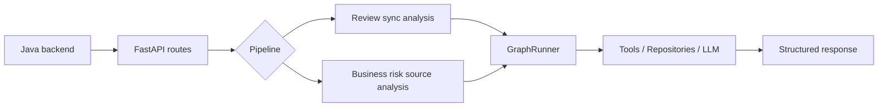
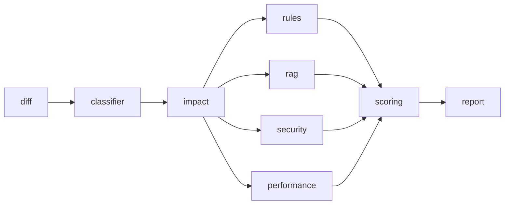
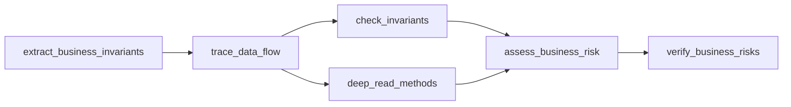

# Python AI Layer

Python 层是本项目的 **FastAPI 计算微服务**：负责接收 Java 网关转发的审查请求，运行 LangGraph 分析流水线，并返回结构化审查结果。

主要读者：
- 维护 Python 服务的后端开发者
- 联调 Java 网关 / MQ / 向量检索的开发者
- 需要本地启动、测试或排查 AI 流水线的贡献者

## 该目录包含什么

- `app/`：FastAPI 入口、依赖装配、HTTP 路由
- `graph/`：LangGraph runner、节点、并行执行与熔断
- `services/`：AI service、任务/结果/日志服务、business-risk worker registry
- `repositories/`：任务、结果、日志、向量检索等存储实现
- `tools/`：规则检测、incident search、AST/图谱等工具
- `tests/`：app / graph / services / repositories / tools / integration 测试

## 请求流



## 暴露的接口

当前 `app/main.py` 注册的 Python 路由：

| Method | Path | 用途 |
|---|---|---|
| POST | `/ai/review/sync` | 执行同步代码审查计算 |
| GET | `/ai/review/tasks/{taskId}` | 查询任务与结果快照 |
| GET | `/ai/review/logs/{taskId}` | 查询节点执行日志 |
| GET | `/ai/review/handoff/{taskId}` | 查询人工复核信息 |
| POST | `/ai/review/handoff/{taskId}` | 提交人工复核决策 |
| POST | `/ai/business-risk/source` | 执行业务风险源码分析 |
| GET | `/ai/health` | 服务健康检查 |
| GET | `/ai/health/business-risk-source` | business-risk worker 就绪检查 |

说明：异步编排由 Java 网关与消息队列负责；Python 层当前公开入口以同步计算与 business-risk worker 能力为主。

## 快速开始

### 1. 安装依赖

```bash
cd python && uv sync
```

### 2. 配置环境变量

复制 `.env.example` 到 `.env`，优先检查这些字段：

- `APP_HOST` / `APP_PORT`
- `PERSISTENCE_BACKEND=sql|inmemory`
- `VECTOR_BACKEND=pgvector|chromadb|stub`
- `TELEMETRY_BACKEND=logging|noop`
- `LLM_API_BASE`
- `LLM_API_KEY`
- `LLM_MODEL`

如果启用 business-risk worker，再补充：

- `BUSINESS_RISK_WORKER_HEARTBEAT_URL`
- `BUSINESS_RISK_WORKER_TOKEN`

> `AppSettings` 定义见 `config/settings.py`。

### 3. 启动服务

Windows 下不要默认使用 `--reload`。

```bash
cd python && uv run uvicorn app.main:app --host 0.0.0.0 --port 8000
```

如果遇到 `ModuleNotFoundError` 或 reloader 解释器异常：

```bash
cd python && .venv/Scripts/python.exe -m uvicorn app.main:app --host 0.0.0.0 --port 8000
```

### 4. 验证健康状态

```bash
curl http://localhost:8000/ai/health
curl http://localhost:8000/ai/health/business-risk-source
```

## 开发常用命令

```bash
cd python && uv sync
cd python && uv run pytest
cd python && uv run ruff check .
cd python && uv run black .
cd python && uv run mypy .
```

运行常用测试子集：

```bash
cd python && uv run pytest tests/app/test_health_route.py -q
cd python && uv run pytest tests/app/test_review_routes.py -q
cd python && uv run pytest tests/app/test_business_risk_source_route.py -q
cd python && uv run pytest tests/services/test_business_risk_source_service.py -q
cd python && uv run pytest tests/services/test_registry.py -q
cd python && uv run pytest tests/graph -q
```

## 使用说明

### 代码审查同步计算

`POST /ai/review/sync` 接收 Java 网关整理后的 payload，执行标准审查流水线并返回 `ReviewResult`。

标准流水线由 `app/dependencies.py` 装配：



核心入口：
- `app/routers/review.py`
- `app/dependencies.py`
- `graph/runner.py`

### Business risk source 分析

`POST /ai/business-risk/source` 面向业务风险源码包分析，要求 worker readiness 为 `UP`。

该流水线独立于标准 review pipeline：



核心入口：
- `app/routers/business_risk_source.py`
- `services/business_risk_source_service.py`
- `services/registry.py`

## 配置与后端切换

### Persistence

- `PERSISTENCE_BACKEND=sql`：使用 SQL repository
- `PERSISTENCE_BACKEND=inmemory`：本地开发 / 轻量测试

任务、结果、日志仓储在 `app/dependencies.py` 中按配置切换。

### Vector

- `VECTOR_BACKEND=pgvector`
- `VECTOR_BACKEND=chromadb`
- `VECTOR_BACKEND=stub`

相关配置：
- `VECTOR_DB_URL`
- `PGVECTOR_TABLE`
- `CHROMA_PATH`
- `CHROMA_COLLECTION`
- `CHROMA_KEYWORD_INDEX_PATH`

### Telemetry

- `TELEMETRY_BACKEND=logging`
- `TELEMETRY_BACKEND=noop`

### LLM

至少需要：
- `LLM_API_BASE`
- `LLM_API_KEY`
- `LLM_MODEL`

business-risk readiness 也会校验 `LLM_API_KEY`。

## 测试结构

| 目录 | 内容 |
|---|---|---|
| `tests/app/` | 路由、健康检查、business-risk 接口 |
| `tests/graph/` | runner、pipeline、节点、并行执行 |
| `tests/services/` | service 与 worker registry |
| `tests/repositories/` | SQL / in-memory / vector / keyword index |
| `tests/tools/` | registry、规则、incident search、AST/图谱 |
| `tests/integration/` | 跨层 wiring 验证 |

## 排障

### Windows 下 `uvicorn --reload` 导入失败

优先改为不带 `--reload` 启动，或直接使用 `.venv/Scripts/python.exe`。

### `/ai/health/business-risk-source` 返回 DOWN

优先检查：
- `LLM_API_KEY` 是否配置
- Java 心跳地址与 token 是否正确
- worker 是否成功启动 `services/registry.py` 的 heartbeat loop

### 路由或 README 内容不一致

以以下文件为准：
- `app/main.py`
- `app/routers/*.py`
- `config/settings.py`

## 相关文档

- 仓库入口：`../README.md`
- 前端说明：`../frontend/README.md`
- Python 设计草稿：`../docs/superpowers/python端计划.md`
- Java 设计草稿：`../docs/superpowers/java端计划.md`

如果后续要继续做文档归拢，建议下一步把 Python 设计 / 部署 / 排障内容从 `docs/superpowers/` 拆到正式的 `docs/architecture/`、`docs/deployment/`、`docs/troubleshooting/`。