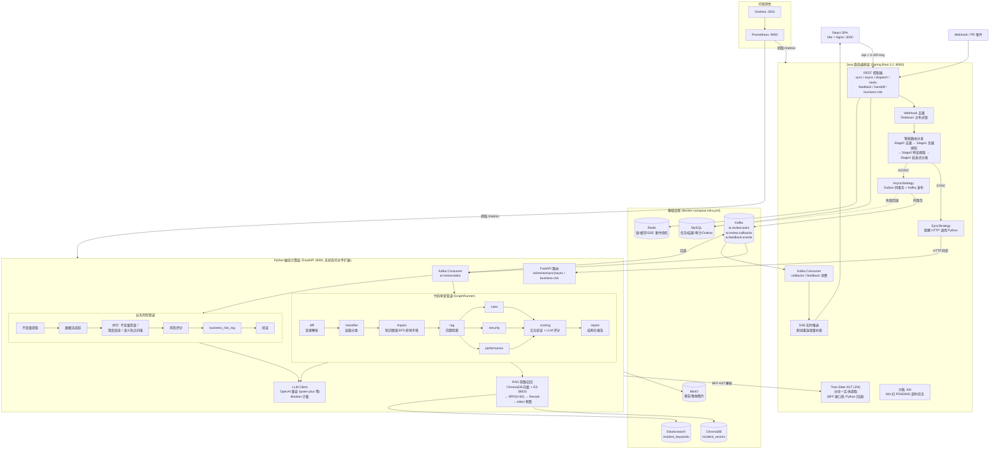
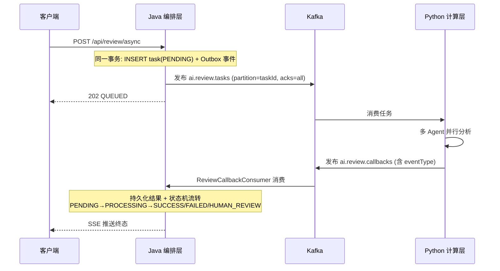

# Sentinel — 智能代码审查平台 架构图

> 基于当前代码库实际实现整理（2026-09-16）。
> 定位：以「规则 + LLM + RAG」三元机制构建的智能代码审查 Agent 平台，覆盖代码漏洞审查与业务风险审查两条链路，支持同步极速拦截 × 异步高可用编排。

---

## 一、系统现状总览

| 维度 | 现状 |
|------|------|
| 架构形态 | 三层异构微服务：React 前端 + Java 稳态编排层 + Python 敏态计算层，1 个 Java 编排端 : N 个 Python 计算端 |
| 审查链路 | ① 代码审查（diff 漏洞分析）② 业务风险审查（不变量 / 数据流 / 语义热点） |
| 执行模式 | 同步极速拦截（HTTP 直调）+ 异步事件驱动（Kafka 双 Topic），智能路由自动分流 |
| 可靠性 | Outbox 本地消息表 + 10 次重试 + 60s 对账兜底 + 超时强杀（四层保障），k6 压测 3000 VU 尖峰零丢失 |
| 实时性 | SSE 长连接推送，`Last-Event-ID` 断线重连增量追平（Redis Stream RecordId） |
| 智能能力 | 多 Agent 并行（3 专家 + 交叉验证评分）、代码知识图谱（NetworkX 加权 BFS 影响半径）、RAG 双路召回（向量 + BM25 → RRF → Rerank） |
| 人机协同 | 高风险 Handoff 人工复核（APPROVE/REJECT/MODIFY）+ 用户反馈闭环（误报/遗漏标记） |
| 可观测性 | Prometheus + Grafana 面板、Micrometer / prometheus-client 指标、全链路 TraceId |
| 工程化 | 三端均有测试（Vitest+Playwright / pytest+Testcontainers / JUnit+WireMock）、6 个 k6 压测场景、Docker Compose 一键编排 |
| 知识库 | 80+ 事故文档（Cloudflare/Azure/CrowdStrike/Vercel 等 postmortem）入库，5 仓库代码索引 |

**一句话评估**：核心链路（路由 → 双模执行 → 多 Agent 分析 → RAG 召回 → 反馈闭环）已完整闭环并有压测数据自证，处于「功能完整、可演示、可压测」阶段；主要欠账在文档同步、部署配置一致性与根目录卫生（见第五节）。

---

## 二、整体架构



---

## 三、核心链路详解

### 3.1 智能路由分发（DispatchStrategy）

```
POST /api/review/dispatch
  ├─ Stage 0 去重: Redisson 分布式锁 (projectId+prUrl, TTL 120s) → 命中直接幂等返回
  ├─ Stage 1 负载: queue>70% 或 active>80% → 强制 ASYNC（削峰）
  ├─ Stage 2 特征: ≤4000 chars / ≤2 文件 / 单模块 / 无风险信号 → SYNC
  │               ≥12000 chars / ≥6 文件 / 多模块 / 有风险信号 → ASYNC
  └─ Stage 3 兜底: 边界情况走启发式分类器打分，置信度 <0.80 → 降级 ASYNC（保守）
```

### 3.2 同步链路（毫秒级拦截）

```
POST /api/review/sync
  → 任务落库(PROCESSING) → PythonComputeClient 阻塞 HTTP 调 Python
  → 结果 upsert + SSE 推送 → 返回完整 ReviewResult
```

### 3.3 异步链路（Kafka 事件驱动）



可靠性四层：Outbox 至少一次投递 → Poller 失败重试 10 次 → 对账 Job 60s 补投 → PROCESSING 超时 2×timeout 强杀。

### 3.4 代码审查管道（Python GraphRunner）

| 阶段 | 节点 | 执行方式 |
|------|------|---------|
| P1 | diff（变更解析） | 串行 |
| P2 | classifier（层级分类） | 串行 |
| P3 | impact（AST + 知识图谱加权 BFS 影响半径，visibility 衰减 2 跳） | 串行 |
| P4 | rag（历史事故前置检索，供下游共享上下文） | 串行 |
| P5 | rules ∥ security ∥ performance（3 专家并行，45s 超时 + 断路器，agent_selector 动态裁剪） | 并行 |
| P6 | scoring（多 Agent 交叉验证：权重 security 3 > rules 2 > perf 1.5 > rag 1，矛盾 → 强制人工复核） | 串行 |
| P7 | report（结构化报告，LLM 失败降级确定性规则引擎） | 串行 |

### 3.5 业务风险管道

不变量提取 → 数据流追踪 → 【并行：不变量检查 / 深度阅读方法 / 语义热点扫描（LLM 并发 5、置信度阈值 0.6）】→ 风险评分 → business_risk_rag → 验证。Java 侧配套 SSE 事件存储（`BusinessRiskEventStore`）、Worker 心跳注册（`BusinessRiskWorkerRegistryService`）与回调鉴权（`X-Worker-Token`）。

### 3.6 反馈与 Handoff 闭环

```
前端 FeedbackWidget（点赞/点踩 + 分类标签 + 评论）
  → Java FeedbackController → MySQL（taskId 幂等）
  → ai.feedback.events Topic → Python 数据闭环（驱动 Prompt/RAG/权重调优）

高风险 / 多 Agent 矛盾 → HUMAN_REVIEW
  → GET/POST /handoff/{taskId} 人工决策 APPROVE / REJECT / MODIFY
```

---

## 四、分层模块清单

### 4.1 前端（`frontend/`）

| 模块 | 说明 |
|------|------|
| `pages/` | SubmitPage · TaskDashboardPage · CodeReviewDetailPage · BusinessRiskSourcePage/DetailPage · FeedbackDashboardPage |
| `api/` | 通用 `http<T>()` 客户端（API-Key + TraceId + AbortController 超时），review/task/logs/feedback/stream/businessRisk 六组接口 |
| `hooks/` | useTaskPolling（轮询兜底）· useBusinessRiskSse（SSE）· useReviewSubmission |
| `store/` | Zustand + Immer：taskStore / resultStore / logStore / status |
| `e2e/` | Playwright 冒烟（sync / async 两条链路） |

技术：React 19 · Vite 8 · TypeScript · TanStack Query · Zustand · Vitest/MSW。

### 4.2 Java 编排层（`backend/`）

| 包 | 职责 |
|----|------|
| `controller/` | 11 个控制器：审查（sync/async/dispatch）、任务、反馈、分块、SSE、Handoff、业务风险（含 2 个 internal 回调） |
| `service/` | ReviewService · DispatchStrategy 体系（策略工厂 + 同步/异步策略）· SSE 注册表 · 事件存储 · Token 用量 · 会话记忆 · Webhook 去重 |
| `service/strategy/` | `ReviewStrategyFactory` + `Dispatch/Sync/Async` 策略模式 |
| `ast/` | Tree-Sitter JNI（Java/Python/SQL），CPU 密集解析前置到本层，为 Python 水平扩展铺路 |
| `client/` | PythonComputeClient（WebClient）· BusinessRiskPythonClient · PythonServiceRegistry（多实例注册） |
| `mq/` | OutboxPoller · ReviewCallbackConsumer · FeedbackEventConsumer |
| `config/` | Security（API Key 过滤器）· 限流 · 线程池 · MyBatis-Plus · 事务 · TraceId 传播 |
| `job/` | ReconciliationJob 对账兜底 |
| `health/` | MySQL/Redis/MQ/Python 真实依赖健康探针 |

技术：Spring Boot 3.2.5 · Spring Cloud Stream（Kafka/Rabbit 双 Binder）· MyBatis-Plus 3.5.9 · Redisson · Micrometer Prometheus。dev 用 H2，prod 用 MySQL。

### 4.3 Python 计算层（`python/`）

| 包 | 职责 |
|----|------|
| `app/` | FastAPI 路由 + 依赖注入（模块级单例 + RLock，后端可切换） |
| `graph/` | GraphBuilder（顺序/并行阶段）· GraphRunner（as_completed 调度 + 超时 + merge 策略）· 17 个节点 · 断路器 · 事件 |
| `domain/` | checkers（SQL 风险/API 兼容/配置变更/测试覆盖）· reviewers（6 类审查器）· business_risk 领域模型（ruff 强制禁止反向依赖） |
| `tools/` | AST 解析（javalang/ast + regex fallback）· 代码知识图谱（NetworkX 加权 BFS）· ToolRegistry |
| `services/` | RAG 检索 · BFF AST 客户端 · 文档加载（PDF/docx/图片）· 检查点续传 · Worker 注册 |
| `repositories/` | 仓储模式：inmemory / SQL 双实现；ChromaDB · ES · BM25 · 关键词索引 |
| `llm/` | OpenAI 兼容客户端 + tiktoken 计量 |
| `mq/` | Kafka 任务消费者 + 回调生产者（aiokafka） |
| `telemetry/` | prometheus-client 指标钩子 |
| `scripts/` | 事故文档抓取/入库 · 代码库索引 · 检索评估 · 反馈导入 |

技术：FastAPI · LangGraph/LangChain · ChromaDB · Elasticsearch · CodeBERT（sentence-transformers, CPU-only torch）· cross-encoder Rerank · NetworkX。

### 4.4 基础设施与监控

| 组件 | 用途 | 端口 |
|------|------|------|
| MySQL | 任务/结果/审计/Outbox/Token 用量 | 3307 |
| Redis | 分布式锁 · 缓存 · SSE 事件快照 | 6379 |
| Kafka | tasks / callbacks / feedback 三 Topic | 9092 |
| MinIO | 审查报告 · 事故图片 | 9000/9001 |
| ChromaDB | 事故向量库（内嵌） | - |
| Elasticsearch 8.15 | 事故关键词 BM25 索引 | 9200 |
| Prometheus / Grafana | 指标采集 / 可视化面板 | 9090 / 3001 |

---

## 五、现状评估：问题与改进建议

### 做得好的（保持）

1. **可靠性设计扎实**：Outbox + 重试 + 对账 + 超时强杀四层保障，且每个指标都有 k6 脚本可复现自证。
2. **异构分层合理**：CPU 密集 AST 前置 Java、Python 无状态水平扩展，吞吐 42→143 req/s 的路径清晰。
3. **分层约束落地**：Python 用 ruff 强制 domain 不反向依赖基础设施，Java 策略模式职责清晰。
4. **降级意识贯穿**：LLM 失败降级规则引擎、SSE 缓存不可用降级 DB 合成、向量库不可用降级关键词。

### 需要注意的问题

| # | 问题 | 位置 | 建议 |
|---|------|------|------|
| 1 | **文档与代码脱节**：CLAUDE.md 仍描述旧管道 `diff→classifier→rules→rag→scoring→report`，缺少 impact 节点与并行组；README 同步超时写 120s，CLAUDE.md 写默认 5s | `CLAUDE.md` | 以代码为准更新 CLAUDE.md，或明确两者口径（配置项 vs 默认值） |
| 2 | **docker-compose 中 Python 用 `PERSISTENCE_BACKEND: inmemory`**，任务/结果不落 MySQL，与 README「全链路对账、DB 为真相源」的描述存在口径差（Java 侧仍是真相源，Python 内存态重启即丢本地状态） | `docker-compose.yml` L33 | 确认是否有意为之；生产建议切 `sql` 或文档中显式说明 Python 侧为缓存态 |
| 3 | **默认 LLM 地址硬编码内网 IP** `http://172.23.255.8:31608/v1` 作为 compose 默认值 | `docker-compose.yml` L48 | 保留占位但 README 已提示降级行为，可接受；建议 `.env.example` 给出更醒目的配置指引 |
| 4 | **根目录卫生**：`resume_tmp.docx`、`check_env.py`、`fetch_postmortems.py`、`upload_run.py`、`simple_ingest.py`、`.askpass.cmd` 等散落根目录，部分属一次性脚本/临时文件 | 仓库根 | 移入 `scripts/` 或删除；`.askpass.cmd` 若含凭据务必确认已被 gitignore |
| 5 | **监控目录混杂运维脚本**：`monitoring/.deploy/` 下 10+ 个 clean_*/triage_* 一次性脚本与正式配置混放 | `monitoring/.deploy/` | 归档或迁移到 `scripts/ops/`，保留 prometheus/grafana 正式配置 |
| 6 | **Python 向量依赖冗余**：pyproject 同时声明 chromadb / pymilvus / pgvector / qdrant-client，实际 compose 只用 chromadb | `python/pyproject.toml` | 未用的后端可移入 optional-dependencies，减小镜像体积 |
| 7 | **明文密钥默认值**：`dev-key` / `dev-callback` / `admin123` 作为 compose 默认值 | `docker-compose.yml` | dev 环境可接受，但需保证 prod 编排（application-prod.yml / 独立 compose）强制环境变量注入，无默认值 |

### 可演进方向（非阻塞）

- **CLAUDE.md / README 自动化校验**：CI 中加一步比对管道节点清单与 `dependencies.py` 实际装配，防止再次脱节。
- **Python 侧多实例指标聚合**：当前 `PythonServiceRegistry` 已有多实例注册雏形，可补齐按实例的 RPS/延迟分布到 Grafana。
- **RAG 知识库更新流水线**：事故文档目前靠 `scripts/` 手工入库，可接 Webhook 自动摄取 + 增量索引。

---

## 六、关键接口速查

| 接口 | 方法 | 说明 |
|------|------|------|
| `/api/review/sync` | POST | 同步审查 |
| `/api/review/async` | POST | 异步审查（202 + taskId） |
| `/api/review/dispatch` | POST | 智能路由自动分流 |
| `/api/review/tasks/{id}` | GET | 任务状态 |
| `/api/internal/review/callback` | POST | Python → Java 结果回调（X-Worker-Token） |
| `/api/feedback` | POST | 用户反馈（taskId 幂等） |
| `/handoff/{taskId}` | GET/POST | 人工复核决策 |
| `/api/business-risk/*` | POST/GET/SSE | 业务风险提交 / 查询 / SSE |
| `/ai/review/sync` / `/ai/review/async` | POST | Python 侧入口 |
| `/actuator/health` / `/ai/health` | GET | 双层健康探针（含真实依赖检查） |
